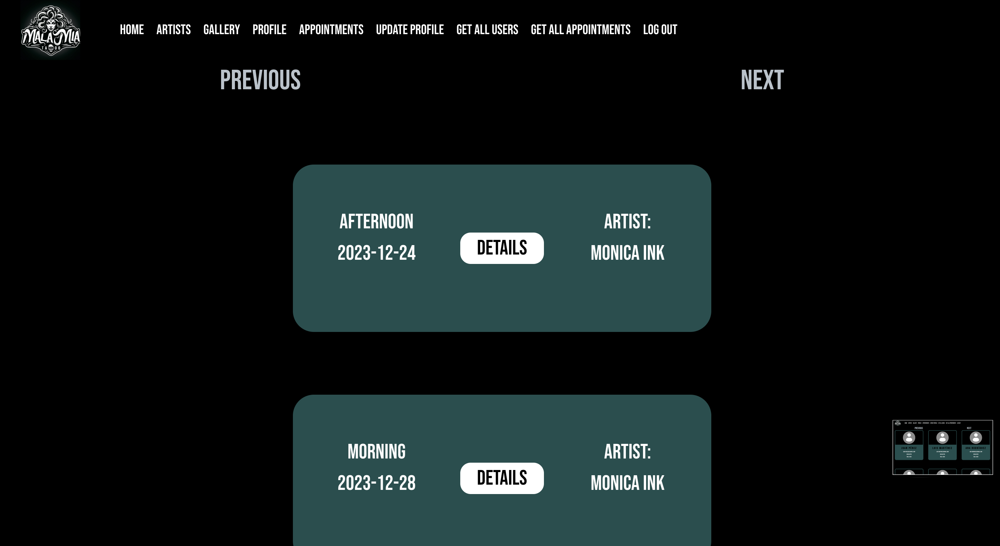
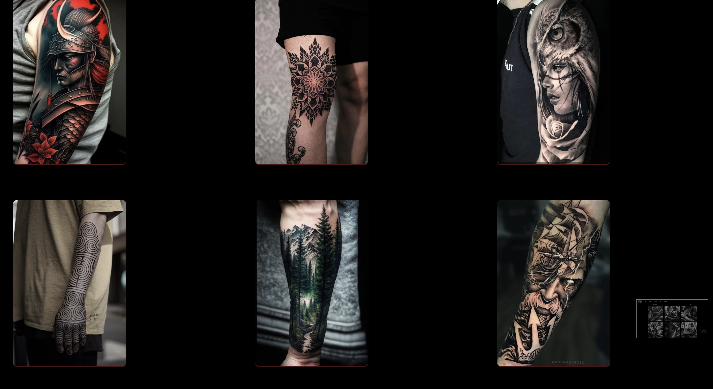
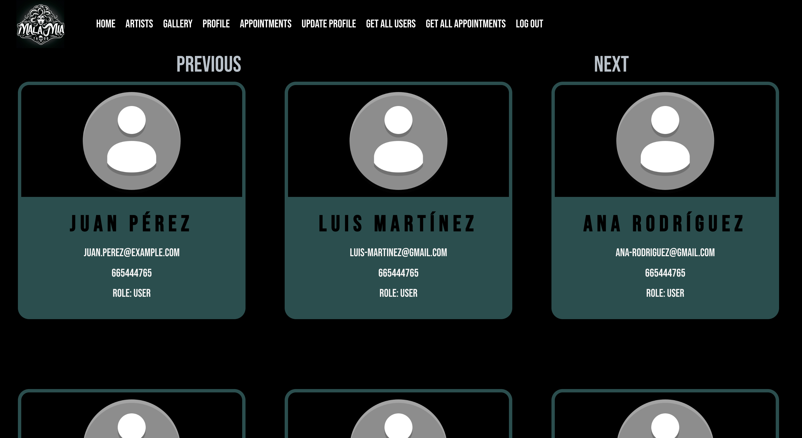
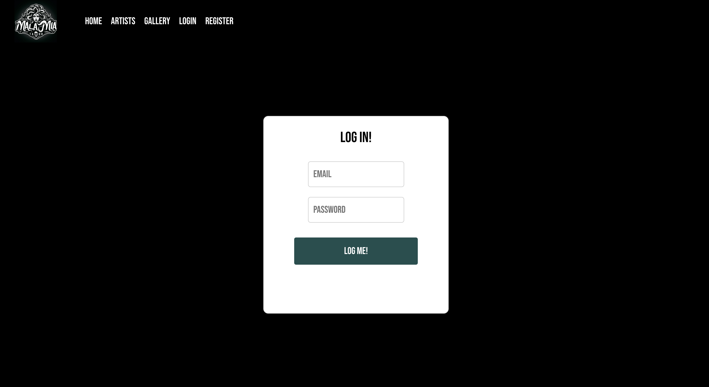
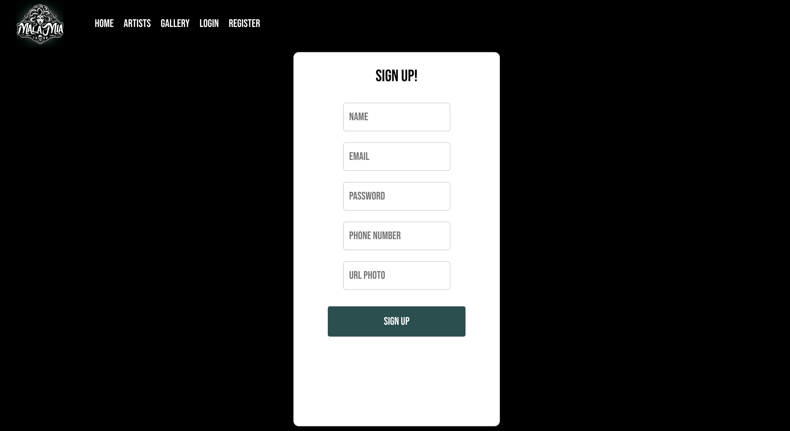

<div align="center">
<a href="https://geekshubs.com/">
        
    </a>
</div>

<h1> ## FRONTEND TATTOO & PIERCING STUDIO 🖋️ ##</h1>

<div align="center">
<a href="https://geekshubs.com/">
        
    </a>
</div>


**Quinto proyecto del Bootcampt Full Stack Developer en GeeksHubs Academy, Valencia**


---
<div align="center">
<a href="https://geekshubs.com/">
        
    </a>
</div>


# Table of Contents

- ### 🚀 [Descripcion](#descripcion)
- ### 🎯 [Objectivo](#objectivo)
- ### 👩🏽‍💻 [Stack](#stack)
- ### 🌱 [Componentes](#componentes)
- ### 👀 [Vistas](#vistas)
- ### 🔝 [Mejoras](#mejoras)
- ### ⚙️ [Local Installation Instructions](#local-installation-instructions)
- ### 📧 [Contact](#contact)
- ### 🌐 [GitHub Pages Link](#github-pages-link)


## Descripción del Proyecto

Este proyecto es la parte frontal (frontend) de un sistema de gestión de citas para un estudio de tatuajes y piercings. Forma parte del quinto proyecto del Bootcamp Full Stack Developer en GeeksHubs Academy, Valencia. La aplicación permite a los usuarios registrarse, realizar login, acceder a su área de cliente y gestionar citas con tatuadores. Además, proporciona funcionalidades específicas para el superadmin, como la gestión de usuarios y citas.

## Objetivo

- Registro y login de usuarios.
- Visualización y gestión de citas para clientes y tatuadores.
- Área de usuario con datos personales.
- Funcionalidades adicionales para el superadmin.

## Stack

El frontend ha sido desarrollado utilizando tecnologías como React, Redux,  Javascript, HTML, Bootstrap, CSS, GIT y GitHub.
</br>
</br>
[]()
[]()
[]()
[]()
[]()
</br>
</br>

## Componentes

### Componente Header

El componente `Header` es la barra de navegación superior de la aplicación. Proporciona acceso a diferentes secciones de la aplicación, dependiendo del estado del usuario y su rol. Aquí hay una breve descripción de las características clave del componente:
<div align="center">
<a href="https://geekshubs.com/">
        
    </a>
</div>
</br>
</br>
- **Logo:**
  - Se muestra el logo de la aplicación, que sirve como enlace para volver a la página principal.

<div align="center">
<a href="https://geekshubs.com/">
        
    </a>
</div>
</br>
</br>

- **Menú de Navegación:**
  - El menú de navegación incluye enlaces a secciones como "Home", "Artists", "Gallery", "Profile", "Appointments" y "Update Profile". Los enlaces específicos disponibles dependen del estado del usuario (logueado o no) y su rol (superadmin o no).
  
- **Burger Icon:**
  - Un icono de hamburguesa se utiliza para alternar la visibilidad del menú en dispositivos móviles o cuando el espacio de la pantalla es limitado. Al hacer clic en este icono, se abre o cierra el menú.

- **Autenticación y Roles:**
  - Si el usuario está autenticado (`rdxToken` existe), se muestran enlaces adicionales relacionados con su perfil y citas.
  - Si el usuario tiene el rol de "super_admin", se añaden enlaces extra para acceder a funciones de administración de usuarios y citas.

- **Botón de Cierre de Sesión:**
  - Si el usuario está autenticado, se muestra un botón para cerrar sesión que permite al usuario cerrar su sesión activa.

- **Lógica del Menú Desplegable:**
  - Se utiliza una lógica de ternaria (`menuOpened ? 'menu-opened' : ''`) para aplicar clases CSS específicas cuando el menú está abierto. Esto se aplica tanto al ícono de hamburguesa como a la lista de enlaces, lo que permite controlar su apariencia basándose en el estado `menuOpened`.

### Ternaria para Cambio en el Menú
```jsx
<div className={`header-style ${menuOpened ? 'menu-opened' : ''}`}>
  {/* ... (código del menú) */}
  <div className={`link-buttons ${menuOpened ? 'menu-links' : ''}`}>
    {/* ... (código de los enlaces) */}
  </div>
</div>
```

- `header-style` y `link-buttons` son clases de estilo base.
- `menu-opened` y `menu-links` son clases que se aplican condicionalmente si `menuOpened` es `true`.

Esta lógica de ternaria garantiza que el estilo del menú y los enlaces cambie dinámicamente según el estado del menú, lo que mejora la experiencia del usuario al interactuar con la barra de navegación.


### Componentes

- **`CardAppointment`:** Representa una tarjeta que muestra información sobre una cita, con opciones para editar y eliminar

<div align="center">
  <a href="https://geekshubs.com/">
        
  </a>
</div>
</br>
</br>

- **`CardArtist`:** Tarjeta que presenta información sobre un artista, como su nombre y su email

<div align="center">
  <a href="https://geekshubs.com/">
          
  </a>
</div>
</br>
</br>


- **`CardService`:** Tarjeta que muestra detalles sobre un servicio de tatuaje o piercing

- **`CardUser`:** Tarjeta que muestra información sobre un usuario, utilizado en la sección para el Super Admin para poder visualizar todos los usuarios de la aplicación

- **`CustomInput`:** Componente de entrada personalizado que puede tener variaciones en su diseño y funcionalidad según el contexto de uso

- **`DropDown`:** Componente desplegable que proporciona opciones para que el usuario seleccione entre varias opciones

- **`EditButton`:** Botón utilizado para activar la edición de las citas

- **`LinkButton`:** Botón utilizado para navegar a otras vistas de la aplicación

- **`PaginationButton`:** Botón utilizado para navegar entre páginas

- **`RemoveButton`:** Botón utilizado para eliminar citas

- **`ShiftToggle`:** Botón necesario para entrar al detalle de las citas


## Vistas

- **`Appointments`:** Vista principal que muestra las citas del usuario logeado

<div align="center">
<a href="https://geekshubs.com/">
        
    </a>
</div>
</br>
</br>


- **`Body`:** Vista fantasma que contiene el contenido principal de la aplicación

- **`CreateAppointment`:** Vista que permite a los usuarios crear nuevas citas

- **`Gallery`:** Vista que muestra una galería de imágenes de tatuajes y piercings


<div align="center">
<a href="https://geekshubs.com/">
        
    </a>
</div>
</br>
</br>


- **`GetAllAppointments`:** Vista que permite a un superadmin obtener una lista de todas las citas existentes en el sistema

- **`GetAllUsers`:** Vista que proporciona a un superadmin una lista de todos los usuarios registrados

<div align="center">
<a href="https://geekshubs.com/">
        
    </a>
</div>
</br>
</br>


- **`GetArtists`:** Vista que muestra el listado de artistas disponibles

- **`Home`:** Vista principal que sirve como la página de inicio de la aplicación
<div align="center">
<a href="https://geekshubs.com/">
        
    </a>
</div>
</br>
</br>

- **`Login`:** Vista que permite a los usuarios autenticarse en la aplicación

<div align="center">
<a href="https://geekshubs.com/">
        
    </a>
</div>
</br>
</br>

- **`Profile`:** Vista que muestra información detallada sobre el perfil del usuario

- **`Register`:** Vista que permite a los nuevos usuarios registrarse en la aplicación

<div align="center">
<a href="https://geekshubs.com/">
        
    </a>
</div>
</br>
</br>


- **`UpdateAppointment`:** Vista que permite a los usuarios editar detalles de citas existentes

- **`UpdateProfile`:** Vista que permite a los usuarios actualizar la información de su perfil

## Mejoras
En futuras actualizaciones, se realizarán mejoras significativas en el diseño de la aplicación con el objetivo de mejorar la **estética general**. Se pondrá especial atención en la implementación de un diseño **responsivo** e implementaré la **búsqueda dinámica** que permitirá a los usuarios realizar búsquedas de manera más eficiente y rápida.

# Instrucciones de Instalación Local

## Clonar Repositorio

1. Clona este repositorio en tu máquina local usando el siguiente comando:

```jsx
 git clone [URL_del_repositorio]
```

## Instalación de Dependencias

1. Entra en la carpeta del proyecto:
    
    ```bash
    cd nombre_de_la_carpeta
    
    ```
    
2. Instala las dependencias utilizando npm:
    
    ```bash
    npm install
    
    ```
    

## Ejecutar la Aplicación

1. Una vez instaladas las dependencias, ejecuta la aplicación con el siguiente comando:
    
    ```bash
    npm start
    
    ```
    
2. Abre tu navegador y visita http://localhost:3000/ para ver la aplicación en acción.


## Contributions

This project is public, and contributions are welcome. If you'd like to contribute, follow these steps:

1. Fork the repository.
2. Create a new branch for your contribution.
3. Make your changes and improvements.
4. Submit a pull request for review and merging.

---

# 📧 Contact

If you have any questions, comments, or suggestions, feel free to contact me at [ladronbravovlc@gmail.com](mailto:ladronbravovlc@gmail.com).

- ***Bienve Ladrón***  
<a href = "mailto:ladronbravovlc@gmail.com"></a>
<a href="https://github.com/ladronbx" target="_blank"></a> 